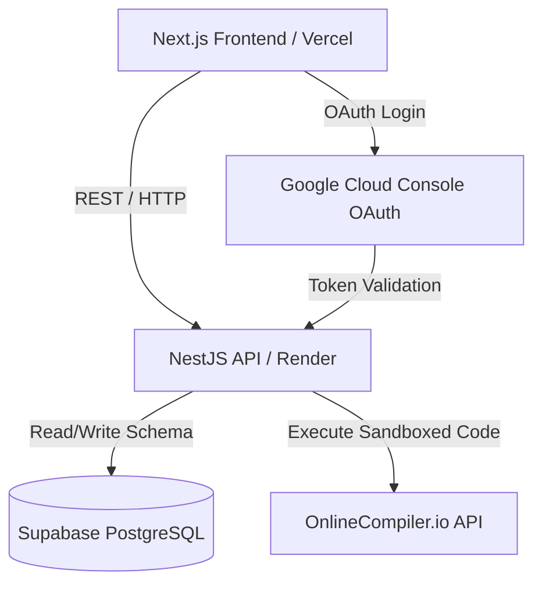

# CodeRudra — Competitive Programming & DSA Platform

CodeRudra is a premium, high-performance online judge and problem-solving practice workspace designed for practicing Data Structures, Algorithms (DSA), and Competitive Programming.

---

## 🚀 Key Features

*   **DSA Practice Bank**: Contains 10 pre-seeded challenges (e.g. Two Sum, Fibonacci, Leap Year, Factorial) each with exactly 5 sample test cases.
*   **KaTeX Latex Engine**: Renders mathematical equations dynamically in problem descriptions and constraints (e.g., $1 \le N \le 10^5$) with zero network latency.
*   **Standalone Compiler Playground**: An independent code editor and terminal executing custom stdin inputs for anonymous and logged-in users alike. It bypasses testcase comparisons, displaying simple **`Run Successful`** or **`Error`** statuses.
*   **Congrats Alert Banner**: Submitting a correct solution that passes all testcases renders a success alert: **`Congrats, all testcases passed!`**.
*   **Clean Monaco Code Editor**: Autocomplete templates loaded without verbose comments, featuring a **"Reset Code"** button with confirmation checks to prevent losing drafts.

---

## 🛠️ Tech Stack & Integrations

### Frontend (`apps/frontend`)
*   **Next.js 16**: App Router framework styled with TailwindCSS variables for a premium, responsive dark-mode workspace.
*   **Zustand**: Lightweight, react-hook-based client state management.
*   **Monaco Editor & KaTeX**: Local bundler integration for instant script editor generation and equation rendering.
*   **Vercel**: Deploying frontend static files and serverless route handlers.

### Backend (`apps/backend`)
*   **NestJS**: TypeScript Node.js framework handling database persistence, OAuth verification, and execution routing.
*   **Render**: Deploying containerized NestJS web api servers.

### Persistence & APIs
*   **Supabase (PostgreSQL)**: Main storage database preserving Users, Problems, Testcases, Submissions, and Saved Solutions.
*   **Google Cloud Console OAuth**: Federated SSO allowing single-click user registration and secure session tokens (JWT).
*   **OnlineCompiler.io API**: Remote sandboxed compiler sync endpoint executing C++ (g++ 14) and Python (Python 3.12) scripts.

---

## 📂 System Architecture



### Request Flow
1.  **Code Execution (Run)**: Front end queries `/execute` with source code and custom stdin. NestJS queries OnlineCompiler.io and returns outputs. If language is Python, execution errors are mapped directly to `ERROR` tags.
2.  **Code Submission (Submit)**: Front end queries `/submit`. NestJS fetches testcases from Supabase, runs them against the compiler, evaluates outputs, logs the submission metrics, and triggers congrats banners if successful. Timeouts are mapped to `TIME_LIMIT_EXCEEDED` statuses.

---

## 💻 Local Setup & Development

### 1. Prerequisites
Ensure you have **Node.js** (v18+) and **npm** installed.

### 2. Install dependencies
From the root workspace directory, run:
```bash
npm install
```

### 3. Environment Configuration
Create environment files for both apps:

#### Backend configuration (`apps/backend/.env`)
```env
PORT=5000
DATABASE_URL="your-supabase-postgresql-connection-string"
JWT_SECRET="your-jwt-token-secret-phrase"
GOOGLE_CLIENT_ID="your-google-oauth-client-id"
GOOGLE_CLIENT_SECRET="your-google-oauth-client-secret"
FRONTEND_URL="http://localhost:3000"
JUDGE0_API_URL="onlinecompiler"
ONLINE_COMPILER_API_KEY="your-onlinecompiler-io-key"
```

#### Frontend configuration (`apps/frontend/.env.local`)
```env
NEXT_PUBLIC_API_URL="http://localhost:5000"
```

### 4. Database Seeding
To apply schemas and populate the database with the demo problems, run:
```bash
npx prisma db push --schema=apps/backend/prisma/schema.prisma
npm run seed --workspace=apps/backend
```

### 5. Running the Application
Launch both Next.js and NestJS development servers concurrently:
```bash
npm run dev
```
*   **Frontend**: http://localhost:3000
*   **Backend**: http://localhost:5000
